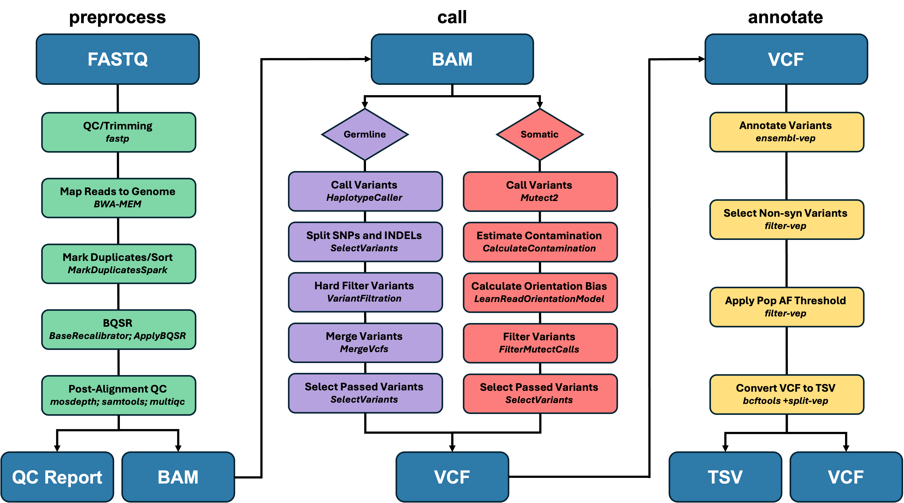

<div align="center">
  <picture>
    <source media="(prefers-color-scheme: dark)" srcset="figures/gates_logo_dark.png">
    <source media="(prefers-color-scheme: light)" srcset="figures/gates_logo_light.png">
    
  </picture>
</div>
## About GATES

GATES (GATK Automated Tool for Exome Sequencing) is a lightweight package that fully automates whole-exome sequencing (WES) analysis in a few simple commands. From raw FASTQ files, GATES implements the GATK Best Practices for somatic and germline variant detection and leverages Ensembl’s Variant Effect Predictor for functional annotation, outputting the results in a human-readable tab-separated values (TSV) file. With both command-line and graphical user interfaces and the ability to run on a standard laptop, GATES makes WES analysis accessible to researchers regardless of their computational experience.    

## Pipeline Overview

GATES is organized into three analytical modules: (1) preprocessing, (2) variant calling, and (3) variant annotation. Each module is run as a single command through either the command-line or graphical user interface. The primary output of each module serves as the input of the next, allowing them to be run independently or sequentially for a given sample. The only user-provided inputs required for complete sample analysis include: raw FASTQ files, a reference genome FASTA file, an exome capture interval file, and an annotation cache (discussed below). The overall GATES pipeline is illustrated in Figure 1, and the details of each module are described below.

<div align="center">
  
  <p><br><i><b>Figure 1.</b> Summary schematic of the GATES pipeline sowing the preprocessing module, variant calling module with separate workflows for germline and somatic modes, and variant annotation and filtering module. Inputs and outputs are shown in blue, with each module’s output serving as the input for the next. Tools used to perform each step in the workflow are shown in italics.</i></p>
</div>

## Installation

### Requirements
- Linux or macOS
- [Conda](https://docs.conda.io/en/latest/miniconda.html)
- Python (to use GUI)
  
### Install GATES

1. **Clone this repository**:
```bash
git clone https://github.com/FrancoResearchLab/GATES.git
cd GATES
```

2. **Create and activate conda environment**:
```bash
# For macOS systems:
conda env create -f environment_mac.yaml
conda activate gates

# For Linux systems:
conda env create -f environment_linux.yaml
conda activate gates
```

3. **Make scripts executable**:
```bash
chmod +x bin/* scripts/*
```

4. **Add GATES to PATH permanently**
```bash
# For zsh shells:
echo 'export PATH="'$(pwd)'/bin:$PATH"' >> ~/.zshrc
source ~/.zshrc

# For bash shells:
echo 'export PATH="'$(pwd)'/bin:$PATH"' >> ~/.bash_profile 
source ~/.bash_profile

# Not sure which shell? Check with:
echo $SHELL
```

5. **Test installation**:
```bash
gates --version
gates --help
```

## Usage

### Graphical User Interface (GUI)
To launch the GATES GUI, simply double-click the `gates-gui` file located within the `GATES/bin/` directory, or run the following command in your terminal: 
```bash 
gates-gui
```

### Command-Line Interface (CLI)

#### Tumor-Only Somatic Variant Analysis
```bash
# Preprocessing
gates preprocess \
    --sample-name SAMPLE_ID \
    --fastq1 sample_R1.fastq.gz \
    --fastq2 sample_R2.fastq.gz \
    --reference hg38.fa \
    --intervals capture_regions.bed \
    --threads 8

# Variant Calling
gates call \
    --tumor-bam preprocessing/mapped_reads/SAMPLE_ID_recal.bam \
    --reference hg38.fa \
    --intervals capture_regions.bed \
    --mode tumor-only \
    --threads 8

# Variant Annotation
gates annotate \
    --sample-name SAMPLE_ID \
    --vcf tumor_only_somatic/variants/SAMPLE_NAME_passed_somatic_variants.vcf.gz \
    --mode tumor-only \
    --cache vep_cache \
    --reference hg38.fa \
    --pop-af 0.01
```

#### Tumor-Normal Somatic Variant Analysis
```bash
# Preprocessing
gates preprocess \
    --sample-name SAMPLE_ID_NORMAL \
    --fastq1 normal_R1.fastq.gz \
    --fastq2 normal_R2.fastq.gz \
    --reference hg38.fa \
    --intervals capture_regions.bed \
    --threads 8

gates preprocess \
    --sample-name SAMPLE_ID_TUMOR \
    --fastq1 tumor_R1.fastq.gz \
    --fastq2 tumor_R2.fastq.gz \
    --reference hg38.fa \
    --intervals capture_regions.bed \
    --threads 8

# Variant Calling
gates call \
    --tumor-bam preprocessing/mapped_reads/SAMPLE_ID_TUMOR_recal.bam \
    --normal-bam preprocessing/mapped_reads/SAMPLE_ID_NORMAL_recal.bam \
    --reference hg38.fa \
    --intervals capture_regions.bed \
    --mode tumor-normal \
    --threads 8

# Variant Annotation
gates annotate \
    --sample-name SAMPLE_ID \
    --vcf tumor_normal_somatic/variants/SAMPLE_NAME_passed_somatic_variants.vcf.gz \
    --mode tumor-normal \
    --cache vep_cache \
    --reference hg38.fa \
    --pop-af 0.01
```

#### Germline Variant Analysis
```bash
# Preprocessing
gates preprocess \
    --sample-name SAMPLE_ID \
    --fastq1 sample_R1.fastq.gz \
    --fastq2 sample_R2.fastq.gz \
    --reference hg38.fa \
    --intervals capture_regions.bed \
    --threads 8

# Variant Calling
gates call \
    --tumor-bam preprocessing/mapped_reads/SAMPLE_ID_recal.bam \
    --reference hg38.fa \
    --intervals capture_regions.bed \
    --mode germline \
    --threads 8

# Variant Annotation
gates annotate \
    --sample-name SAMPLE_ID \
    --vcf germline/variants/SAMPLE_NAME_passed_germline_variants.vcf.gz \
    --mode germline \
    --cache vep_cache \
    --reference hg38.fa \
    --pop-af 0.01
```
> Note: For germline analysis, use `--tumor-bam` to specify your sample BAM file, regardless of whether it is a tumor or normal sample.

## Module Descriptions and Command Reference

### Preprocessing
The preprocessing module takes paired-end WES FASTQ files and outputs aligned, analysis-ready BAM files. These files can be used to visualize read alignments and also serve as the input for the variant calling module. The preprocessing module includes: 
- Pre-alignment QC and adapter trimming
- Alignment to reference genome
- Duplicate marking and BAM file sorting
- Base quality score recalibration
- Post-alignment QC

```
Usage: gates preprocess [arguments] [options]

Arguments: 
    -s, --sample-name <string>      sample identifier [REQUIRED]
        --fastq1 <path>             forward FASTQ file [REQUIRED]
        --fastq2 <path>             reverse FASTQ file [REQUIRED]
    -r, --reference <path>          reference hg38/GRCh38 FASTA file [REQUIRED]
    -i, --intervals <path>          BED/VCF/.interval_list/.list/.intervals file specifying exon capture intervals [REQUIRED] 

Options: 
        --supp-files <path>         supporting files directory downloaded on initial run [OPTIONAL] 
    -t, --threads <integer>         threads to use in programs that support multithreading [OPTIONAL] [1]
    -v, --verbose                   display tool outputs
    -h, --help                      show help message    
```

### Variant Calling
The variant calling modules takes aligned BAM files and outputs VCF files containing raw variants. These files serve at the input for the variant annotation module. GATES supports variant calling in three different modes: paired tumor-normal somatic, tumor-only somatic, and germline. The variant calling module includes the following, based on calling mode:

*Somatic Variant Calling*
- Variant calling using Mutect2 (with or without paired-normal sample)
- Filtering using pre-compiled panel of normals and common germline variants
- Filtering based on contamination estimates and read-orientation biases
  
*Germline Variant Calling*
- Variant calling using HaplotypeCaller
- Seperate hard filtering for SNP and INDEL variants

```
Usage: gates call [arguments] [options]

Arguments: 
        --tumor-bam <path>          preprocessed tumor BAM file [REQUIRED]
        --normal-bam <path>         preprocessed normal BAM file [REQUIRED if --mode tumor-normal]
    -r, --reference <path>          reference FASTA file [REQUIRED]
    -m, --mode <string>             mode to run variant calling. possible values: {tumor-only, tumor-normal, germline} [REQUIRED]
    -i, --intervals <path>          BED/VCF/.interval_list/.list/.intervals file specifying exon capture intervals [REQUIRED]

Options: 
        --supp-files <path>         supporting files directory downloaded on initial run [OPTIONAL]      
    -t, --threads <integer>         threads to use in programs that support multithreading [OPTIONAL] [1]    
    -v, --verbose                   display tool outputs
    -h, --help                      show help message     
```

### Variant Annotation
The annotation module takes raw, unannotated VCF files and outputs both annotated VCFs and human-readable TSV files of potentially pathogenic variants. GATES annotates variants with gene symbols, amino acid changes, population allele frequencies, SIFT and PolyPhen predictions, rsIDs, ClinVar status, and tumor allele frequencies. The variant annotation module includes: 
- Variant annotation using Ensembl's VEP
- Filtering of synonymous variants
- Filtering of common SNPs based on population allele frequencies
- Creation of TSV table of variants

```
Usage: gates annotate [arguments] [options]

Arguments: 
    -s, --sample-name <string>      sample identifier [REQUIRED]
        --vcf <path>                input VCF file for annotation [REQUIRED]
    -m, --mode <string>             mode in which variant calling was run. possible values: {tumor-only, tumor-normal, germline} [REQUIRED]
    -c, --cache <path>              directory housing the unzipped VEP cache file [REQUIRED]
    -r, --reference <path>          reference hg38/GRCh38 FASTA file [REQUIRED]
    -a, --pop-af <float>            maximum population allele frequency (0-1) threshold for filtering [OPTIONAL] [0.01]

Options: 
    -v, --verbose                   display tool outputs
    -h, --help                      show help message  
```

## Input Files

### Preprocessing Input
1. Paired-end FASTQ files
2. Reference hg38/GRCh38 FASTA file
3. Capture interval file: BED file or interval list defining exon capture regions

### Variant Calling Input
1. Preprocessed BAM file(s) (produced by `gates preprocess`)
2. Reference hg38/GRCh38 FASTA file
3. Capture interval file: BED file or interval list defining exon capture regions

### Variant Annotation Input
1. VCF file (produced by `gates call`)
2. VEP cache (the input path should point to the directory that contains the cache, not the cache itself)
3. Reference hg38/GRCh38 FASTA file 

### Downloading VEP cache file
The VEP cache file should be downloaded from Ensembl via the following link: https://ftp.ensembl.org/pub/release-115/variation/indexed_vep_cache/homo_sapiens_refseq_vep_115_GRCh38.tar.gz. The cache downloads as a .tar.gz file that must be extracted and decompressed before running GATES. The file is ~25 GB.

### Automatically Downloaded Resources
GATES automatically downloads and organizes the following reference databases that are used during preprocessing and variant calling:
1. Mills_and_1000G_gold_standard.indels.hg38.vcf.gz(.tbi) (downloaded and used during preprocessing)
2. Homo_sapiens_assembly38.known_indels.vcf.gz(.tbi) (downloaded and used during preprocessing)
3. Homo_sapiens_assembly38.dbsnp138.vcf(.idx) (downloaded and used during preprocessing)
4. 1000g_pon.hg38.vcf.gz(.tbi) (downloaded and used during variant calling)
5. af-only-gnomad.hg38.vcf.gz(.tbi) (downloaded and used during variant calling)
6. small_exac_common_3.hg38.vcf.gz(.tbi) (downloaded and used during calling)

These files are stored in the `supporting_files/` folder in the project directory. To speed up subsequent GATES runs and prevent redownloading of these files, you can simply point to an already existing `supporting_files/` directory using the `--supp-files` argument in your command (or via the "Supporting Files" browse button in the GATES GUI). GATES will automatically detect existing files and skip their download.

## Output Files

### Preprocessing Outputs
After running `gates preprocess`, the aligned BAM file and QC report are found in the following directories: 
```
project_directory/
├── preprocessing/
│   ├── mapped_reads/
│   │   ├── SAMPLE_NAME_recal.bam
│   │   └── SAMPLE_NAME_recal.bai
│   └── qc/
│       └── SAMPLE_NAME_multiqc_report.html
```
It is important to keep the `*.bai` file in the same directory as the BAM file as it is needed for many downstream tools. These index files are also necessary for viewing the preprocessed BAM in visualization programs. 

### Variant Calling Outputs
After running `gates call`, the VCF files are found in the following directory:
```
project_directory/
├── preprocessing/
├── MODE/
│   └── variants/
│       ├── SAMPLE_NAME_all_germline_variants.vcf.gz
│       └── SAMPLE_NAME_passed_germline_variants.vcf.gz
```
The output folder is named based on analysis mode (`germline/`, `tumor_only_somatic/`, or `tumor_normal_somatic/`) and VCF file names indicate whether whether called variants are germline or somatic. `SAMPLE_NAME_passed_*_variants.vcf.gz` contains only variants that passed filtering, representing high-confidence calls. `SAMPLE_NAME_all_*_variants.vcf.gz` includes both passing and non-passing variants with the `FILTER` field annotated based on which filtering criteria each variant did not pass. This file may be useful for quality control, however, it is recommended to use only passing variants for downstream analysis. 

### Annotation Outputs
After running `gates annotate`, the annotated VCF and TSV files are found in the following directory:
```
project_directory/
├── preprocessing/
├── MODE/
│   └── variants/
│       └── annotated_variants/
│           ├── SAMPLE_NAME_all_variants_annotated.vcf
│           ├── SAMPLE_NAME_rare_nonsyn_variants.vcf
│           ├── SAMPLE_NAME_rare_nonsyn_variants.tsv
│           └── SAMPLE_NAME_vep_stats.html
``` 
`SAMPLE_NAME_all_variants_annotated.vcf` contains all variants with their functional annotations. `SAMPLE_NAME_rare_nonsyn_variants.vcf` and `SAMPLE_NAME_rare_nonsyn_variants.tsv` contain non-synonymous variants that are present below the user-specified population allele frequency threshold, representing alterations that are most likley to be pathogenic. The TSV file is automatically formatted for easy visualization in Excel.

## Log Files
GATES generates timestamped log files for each run that are stored in the project directory. Check these for detailed error messages:
```bash
ls *.log
tail -50 YYYY-MM-DD_HH-MM-SS_gates_preprocess.log
```

## License

MIT License - see [LICENSE](LICENSE) file for details.

## Citation

If you use GATES in your research, please cite:

```
Bambach, NE (2026). GATES: GATK Automated Tool for Exome Sequencing v1.3.0. 
GitHub. https://github.com/FrancoResearchLab/GATES
```